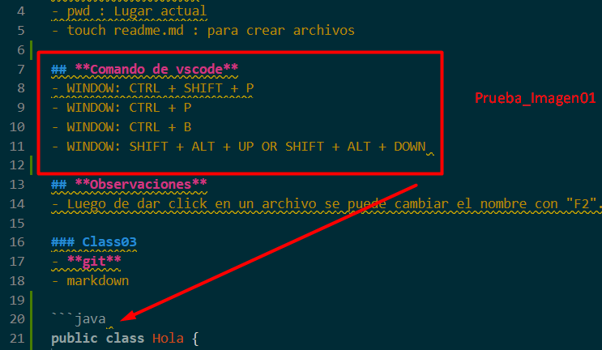

# Class02 : 30 de Abrl

## Comando de Linux
- pwd : Lugar actual
- touch readme.md : para crear archivos

## **Comando de vscode**
- WINDOW: CTRL + SHIFT + P
- WINDOW: CTRL + P
- WINDOW: CTRL + B
- WINDOW: SHIFT + ALT + UP OR touch SHIFT + ALT + DOWN 

## **Observaciones**
- Luego de dar click en un archivo se puede cambiar el nombre con "F2".

# Class03: 1 de May
- **git**
- markdown

```java 
public class Hola {
    public static void main (String[] args) {
        System.out.println():
    }     
}
```

|Columna 1|Columna 2|
|---------|---------|
|    A    |    B    |
|    C    |    D    |

Link
[buscador google](https://google.com)



# Class04: 6 de May
## Origen de Java:
 - Scott y Patrick se reunieron y crearon una nueva forma de resolver un proyecto al escribir algo diferente y ahi fue que surgió el compilador de Java.
 - El compilador y el interprete generan el código de máquina que esta diseñado para correr en el sistema operativo.
 - Ellos dejaron un código intermedio, es decir se utiliza el mismo compilador pero deja un **bytecode** (en java es un punto class). Sobre los sistemas operativos se instala el famoso SDK (hay para cada versión) y Las compilaciones generan un .class que se empaquetan. Luego con toma el código de máquina para distribuirlo a cada sistema operativo.
 - Ese mismo principio se utilizó para los dispositivos móviles.
###**¿Cómo funciona Java?**
1. **Código**: Escrito por los programadores.
2. **Compilación**: Esta compilación devuelve un Bytecode.
3. **BYTECODE**: Sn instrucciones para la Java Virtual Machine.
4. **JVM***: La Java Virtual Machine interpreta el bytecode.
5. **Multiplataforma**: Se ejecuta en diferentes sistemas operativos.

###**Tipos de lenguaje**
 - *Compilado*: Convierte el Código a binarios que lee el sistema operativo. 
 - *Interpretado*: Requiere de un programa que lea la instrucción del código en tiempo real y lo ejecute.
 - *Intermedio*: Se compila el código fuente a un lenguaje intermedio y este último se ejecuta en una máquina virtual.

###**Sabores de JAVA**
Es usado para: 
 - Mobile applications (specialis Android apps)
 - Desktop applications
 - Web applications
 - Web Server and application servers
 - Games
 - Database connection
 - And much , much more!

El trabajo multiplataforma, gracias al Java Virtual Machine, además que es uno de los lenguajes más utilizados en el mundo.
Es fácil de aprender y tienes otras varias características. 
Es el padre de los lenguajes CC, esta bien estructurado y se deriva del entorno de trabajo. 
###**Sintaxis de JAVA**

```java 
//Package pertenece a un paquete
package team.ed.course;

//Importa los paquetes para el proyecto
import Java.lang.*;

//Java usa clases para ejecutar el código
public class Person {

//Se debe indicar el tipo de dato
 private String name;

//Modificadores de acceso: private, public, protector o por defecto ninguno
//El método principal en Java es el método main
 private static void main(String algo[]) {

//La palabra reservada new crea un objeto del tipo de dato especificado
  Person friend = New Person () ;

  friend.name = "Peter";
  System.out.println(" Hola " + friend.name) ;
 }
}
}
```
# Class05: 7 de May 
si
