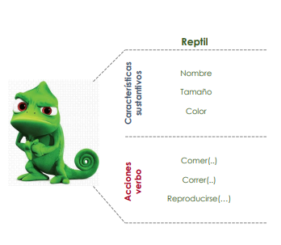
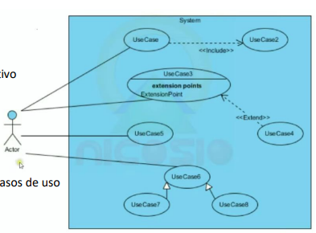
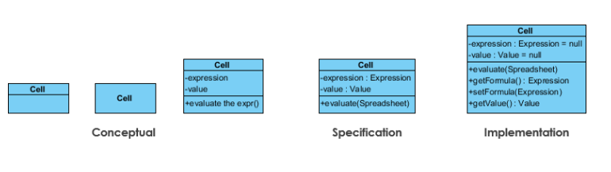

# Class02 : 30 de Abrl

## Comando de Linux
- pwd : Lugar actual
- touch readme.md : para crear archivos

## **Comando de vscode**
- WINDOW: CTRL + SHIFT + P
- WINDOW: CTRL + P
- WINDOW: CTRL + B
- WINDOW: SHIFT + ALT + UP OR touch SHIFT + ALT + DOWN 

## **Observaciones**
- Luego de dar click en un archivo se puede cambiar el nombre con "F2".

# Class03: 1 de May
- **git**
- markdown

```java 
public class Hola {
    public static void main (String[] args) {
        System.out.println():
    }     
}
```

|Columna 1|Columna 2|
|---------|---------|
|    A    |    B    |
|    C    |    D    |

Link
[buscador google](https://google.com)


# Class04: 6 de May
## Origen de Java:
 - Scott y Patrick se reunieron y crearon una nueva forma de resolver un proyecto al escribir algo diferente y ahi fue que surgió el compilador de Java.
 - El compilador y el interprete generan el código de máquina que esta diseñado para correr en el sistema operativo.
 - Ellos dejaron un código intermedio, es decir se utiliza el mismo compilador pero deja un **bytecode** (en java es un punto class). Sobre los sistemas operativos se instala el famoso SDK (hay para cada versión) y Las compilaciones generan un .class que se empaquetan. Luego con toma el código de máquina para distribuirlo a cada sistema operativo.
 - Ese mismo principio se utilizó para los dispositivos móviles.
### **¿Cómo funciona Java?**
1. **Código**: Escrito por los programadores.
2. **Compilación**: Esta compilación devuelve un Bytecode.
3. **BYTECODE**: Sn instrucciones para la Java Virtual Machine.
4. **JVM***: La Java Virtual Machine interpreta el bytecode.
5. **Multiplataforma**: Se ejecuta en diferentes sistemas operativos.

### **Tipos de lenguaje**
 - *Compilado*: Convierte el Código a binarios que lee el sistema operativo. 
 - *Interpretado*: Requiere de un programa que lea la instrucción del código en tiempo real y lo ejecute.
 - *Intermedio*: Se compila el código fuente a un lenguaje intermedio y este último se ejecuta en una máquina virtual.

### **Sabores de JAVA**
Es usado para: 
 - Mobile applications (specialis Android apps)
 - Desktop applications
 - Web applications
 - Web Server and application servers
 - Games
 - Database connection
 - And much , much more!

El trabajo multiplataforma, gracias al Java Virtual Machine, además que es uno de los lenguajes más utilizados en el mundo.
Es fácil de aprender y tienes otras varias características. 
Es el padre de los lenguajes CC, esta bien estructurado y se deriva del entorno de trabajo. 
###**Sintaxis de JAVA**

```java 
//Package pertenece a un paquete
package team.ed.course;

//Importa los paquetes para el proyecto
import Java.lang.*;

//Java usa clases para ejecutar el código
public class Person {

//Se debe indicar el tipo de dato
 private String name;

//Modificadores de acceso: private, public, protector o por defecto ninguno
//El método principal en Java es el método main
 private static void main(String algo[]) {

//La palabra reservada new crea un objeto del tipo de dato especificado
  Person friend = New Person () ;

  friend.name = "Peter";
  System.out.println(" Hola " + friend.name) ;
  //Se utilizan ; para cada sentencia.
  // Se usan {} para identificar el bloque de código.
 }
}
```
### **Estructurado vs O.O.**
**La programación estructurada** es un paradigma de programación que se enfoca en mejorar la claridad, calidad y tiempo de desarrollo de un programa de computadora. Se caracteriza por el uso de subrutinas y tres estructuras de control básicas: secuencia, selección (if y switch) e iteración (bucles for y while). Este enfoque permite a los programadores escribir código que es más fácil de entender, depurar y mantener.


**La Programación Orientada a Objetos (POO)** es un paradigma de programación que utiliza “objetos” como elementos centrales para diseñar y programar aplicaciones de software1. En POO, cada objeto es una instancia de una clase, que define los atributos (datos) y métodos (funciones) del objeto. Los objetos pueden interactuar entre sí, lo que permite crear sistemas complejos y modulares.


### **Algoritmia**
- **Diagrama de flujo**

Un *diagrama de flujo* es una representación gráfica de un proceso, sistema o algoritmo informático¹. Se utiliza para documentar, estudiar, planificar, mejorar y comunicar procesos complejos de manera clara y comprensible. Los diagramas de flujo son útiles en una variedad de campos y pueden ser tan simples como un esquema dibujado a mano o tan detallados como un diagrama computarizado que describe múltiples pasos y rutas¹.


### **Código**
- cd (nombre de carpeta): Para entrar a una carpeta desde git.
- javac App.java: Para compilar
- java App.java: Para ejecutar el programa

- App.java:

```java 
public class App{
    //propiedad
    public static void main (String[]args){
        //variable
        int n = 10;
        int m = 10;
        //for (int i=2; i<n; i+=2)
        //  if (i==6)
        //      System.out.println("Hay un seis);
        //  else
        //      Systm.out.println(i);
        for(int i=2; i<n; i+=2)
            System.out.println((i==6)?"Hay un seis":i);
            //for(;;)
                //System.out.println("Keyaru");
    }
}
```
El código define una clase App con un método principal main. Dentro del método, se declaran dos variables enteras n y m, ambas inicializadas a 10, aunque solo n se usa. Hay un bloque de código comentado que contiene un bucle for que imprimía números pares entre 2 y 10, indicando específicamente cuando el número es 6. El bucle for activo realiza una tarea similar: comienza con i en 2 y se incrementa en 2 en cada iteración, ejecutándose mientras i sea menor que 10. Dentro del bucle, usa el operador ternario para imprimir "hay un seis" si i es igual a 6, y el valor de i en otros casos. También hay un bucle for infinito comentado que, de estar activo, imprimiría "patmic" indefinidamente. La salida del programa actual es: "2", "4", "hay un seis" y "8".


# Class05: 7 de May 
## **Flujo de control y diagrama de flujo**
El flujo de control del programa comienza en el método main, donde se declaran las variables n y m con el valor 10, aunque solo n se usa. Un bucle for se inicia con i igual a 2 y se incrementa en 2 en cada iteración, ejecutándose mientras i sea menor que 10. En cada iteración, si i es 6, se imprime "hay un seis"; de lo contrario, se imprime el valor de i. Esto resulta en la salida de 2, 4, "hay un seis" y 8. El programa finaliza cuando i alcanza 10. El diagrama de clase muestra una clase App con un único método main que no retorna ningún valor y toma un arreglo de String como argumento.


### **Codigo**
- App.java:
```java
public class App {
    public static void main(String[] args) throws Exception {
        //declaracion de la variable bF de tipo BucleFor
        int a;
        BucleFor bucleFor;

        //instanciar new
         bucleFor = new BucleFor() ;

         //llamar a un método
         bucleFor .SignoAlterno();
    }
}
```

El código define una clase App con un método main que puede lanzar una excepción. Dentro del método, se declara una variable entera a y una variable bucleFor de tipo BucleFor. Luego, bucleFor se inicializa como una nueva instancia de la clase BucleFor. Finalmente, se llama al método SignoAlterno en el objeto bucleFor. Este programa parece depender de otra clase llamada BucleFor que define el método SignoAlterno
- BucleFor.class:
```java
public class BucleFor {
    public void SignoAlterno(){

        for(int i=1; i<15; i++){
            if (i%2==0) {
                System.out.print("- ");
            } else {
                System.out.print("+ ");
                System.out.print("");
            }
        }
    }

}
```
La clase BucleFor define un método público SignoAlterno que utiliza un bucle for para iterar desde 1 hasta 14. En cada iteración, si el valor de i es par (i.e., i % 2 == 0), imprime un signo menos ("- "); si es impar, imprime un signo más ("+ "). El resultado es una secuencia alternada de signos más y menos que se imprimen en una sola línea, generando una salida de "+ - + - + - + - + - + - + -".
# Clase06: 8 de Mayo
- App.java:
```java
public class App {
    public static void main(String[] args) throws Exception {
       //declarar
        BucleFor bf;
        BucleWhile bw;

        //instanciar
        bf = new BucleFor();
        bw = new BucleWhile();

        //llamar al metodo
        bf.signoAlterno();
        bf.signoAlternoGenerativo();
        bf.signoAlternoGenerativoMe();
        bf.escalera();
        bw.signoAlterno();
        bw.signoAlternoGenerativoMe();
    }
    
}
=======
public class App {
    public static void main(String[] args) throws Exception {
       //declarar
        BucleFor bf;
        BucleWhile bw;

        //instanciar
        bf = new BucleFor();
        bw = new BucleWhile();

        //llamar al metodo
        bf.signoAlterno();
        bf.signoAlternoGenerativo();
        bf.signoAlternoGenerativoMe();
        bf.escalera();
        bw.signoAlterno();
        bw.signoAlternoGenerativoMe();
    }
    
}

```
El código muestra la clase App con su método main, el cual puede lanzar excepciones. Dentro del método, se declaran dos variables: bf de tipo BucleFor y bw de tipo BucleWhile. Posteriormente, se instancian objetos para ambas variables utilizando new, creando así nuevas instancias de las clases BucleFor y BucleWhile. A continuación, se llaman varios métodos en el objeto bf: signoAlterno, signoAlternoGenerativo, signoAlternoGenerativoMe y escalera. Estos métodos realizan operaciones específicas que probablemente involucran la impresión de patrones de caracteres o números, según sus nombres sugieren. Luego, se llaman dos métodos en el objeto bw: signoAlterno y signoAlternoGenerativoMe, que también pueden realizar operaciones similares pero pertenecen a la clase BucleWhile. Este código organiza y ejecuta múltiples funciones de bucles y patrones, posiblemente para propósitos de demostración o práctica de programación estructurada en Java.

- BucleFor.java:
```java
public class BucleFor {
    // metodo : +-+-+-+-
    public void signoAlterno() {
        System.err.println("FOR: ");
        for (int i = 1; i < 10; i++) {
            if (i % 2 == 0)
                System.out.print("- ");
            else
                System.out.print("+ ");
        }
        System.out.println("");
    }

    public void signoAlternoGenerativo() {
        System.out.println("FOR: ");
        for (int i = 1; i < 10; i++) {
            if (i % 2 == 0)
                for (int sn = 1; sn < i; sn++)
                    System.out.print("-");
            else
                for (int sp = 1; sp < i; sp++)
                    System.out.print("+");
            System.out.print("  ");
        }
        System.out.println("");
    }
    //metodo - ++ --- ++++ ----- ++++++
    public void signoAlternoGenerativoMe() {
        System.err.println("FOR:");
        for (int i = 1; i < 10; i++) {
            for (int s = 1; s < i; s++)
            System.out.print((i % 2 == 0) ? "-" : "+");
            System.out.print("  ");
        }
        System.out.println("  ");
    }
    
    //metodo - ++ --- ++++ ----- ++++++
    public void escalera() {
        int level = 10;
        String escalon = "|_";
        for (int i = 1; i < level; i++) {
            for (int s = 1; s < i; s++) {
                    System.out.print("  ");
            }
            System.out.println(escalon);
        }

    }
=======
public class BucleFor {
    // metodo : +-+-+-+-
    public void signoAlterno() {
        System.err.println("FOR: ");
        for (int i = 1; i < 10; i++) {
            if (i % 2 == 0)
                System.out.print("- ");
            else
                System.out.print("+ ");
        }
        System.out.println("");
    }

    public void signoAlternoGenerativo() {
        System.out.println("FOR: ");
        for (int i = 1; i < 10; i++) {
            if (i % 2 == 0)
                for (int sn = 1; sn < i; sn++)
                    System.out.print("-");
            else
                for (int sp = 1; sp < i; sp++)
                    System.out.print("+");
            System.out.print("  ");
        }
        System.out.println("");
    }
    //metodo - ++ --- ++++ ----- ++++++
    public void signoAlternoGenerativoMe() {
        System.err.println("FOR:");
        for (int i = 1; i < 10; i++) {
            for (int s = 1; s < i; s++)
            System.out.print((i % 2 == 0) ? "-" : "+");
            System.out.print("  ");
        }
        System.out.println("  ");
    }
    
    //metodo - ++ --- ++++ ----- ++++++
    public void escalera() {
        int level = 10;
        String escalon = "|_";
        for (int i = 1; i < level; i++) {
            for (int s = 1; s < i; s++) {
                    System.out.print("  ");
            }
            System.out.println(escalon);
        }

    }
}
```
La clase BucleFor contiene cuatro métodos públicos que imprimen diferentes patrones utilizando bucles for.

1. El método signoAlterno imprime una secuencia alternada de signos más y menos (+ - + - ...) en una sola línea utilizando un bucle for.

2. El método signoAlternoGenerativo imprime un patrón donde las líneas pares contienen una cantidad creciente de guiones (-) y las líneas impares contienen una cantidad creciente de signos más (+). Cada patrón se imprime en líneas separadas con un espacio al final.

3. El método signoAlternoGenerativoMe también genera un patrón de signos más y menos, pero en este caso, el número de caracteres en cada línea aumenta según el número de la línea. Las líneas pares contienen guiones (-) y las impares contienen signos más (+). Cada patrón se imprime en líneas separadas.

4. El método escalera imprime una escalera vertical con un nivel máximo de 10. Cada nivel de la escalera es representado por el string |_, y cada nivel se desplaza horizontalmente hacia la derecha en relación a su nivel.

Estos métodos demuestran diversas formas de utilizar bucles for para generar y mostrar patrones simples y estructuras repetitivas en la consola.
- BucleWhile.java:
```java
public class BucleWhile {
    // metodo : +-+-+-+-
    public void signoAlterno() {
        System.out.println("WHILE: ");
        int i = 1;
        while (i < 10) {
            if (i % 2 == 0)
                System.out.print("- ");
            else
                System.out.print("+ ");
            i++;
        }
        System.out.println();
    }

    public void signoAlternoGenerativoMe() {
        System.out.println("WHILE:");
        int i = 1 ;
        while (i < 10) {
            int s = 1;
            while (s < i) {
                System.out.print((i % 2 == 0) ? "-" : "+");
                s++;
            }
            System.out.print("  ");
            i++;
        }
        System.out.println("  ");
    }
}

=======
public class BucleWhile {
    // metodo : +-+-+-+-
    public void signoAlterno() {
        System.out.println("WHILE: ");
        int i = 1;
        while (i < 10) {
            if (i % 2 == 0)
                System.out.print("- ");
            else
                System.out.print("+ ");
            i++;
        }
        System.out.println();
    }

    public void signoAlternoGenerativoMe() {
        System.out.println("WHILE:");
        int i = 1 ;
        while (i < 10) {
            int s = 1;
            while (s < i) {
                System.out.print((i % 2 == 0) ? "-" : "+");
                s++;
            }
            System.out.print("  ");
            i++;
        }
        System.out.println("  ");
    }
}
```
Al ejecutarlo pasa exactamente lo mismo con los bucles for, pero estos metodos utilizan el bulce while.
# Clase09: 13 de Mayo
## 1.Conceptualizacion-> Prototipado
Idea de lo que quiere realizar: Puede dibujar
- Caracterización: Propiedades
- Acciones: Métodos
Las características (Propiedad) debe poder almacenar como datos.

### **Método:**

Ámbito:
- Public
- Private
- Protected
- Friendly

Parámetro: Información adicional para que se cumpla según mi criterio.
## 2.**UML:** Diagrama de clase
| + Mujer    |
|---------------|
| - edad:Float      |
| + ojos: Boolean   |
| + cabello: String |
|                   |
| ~ bailar (cancion: String, tiempo: int, ritmo: String):void
## 3. Código(Java)
```java
public class Mujer{
    private Float edad;
    private Boolean ojos;
    public String cabello;
    protected String Bailar(String cancion, int tiempo, String ritmo){
        return "Baile de maravilla"
    }
}
```
# Clase10: 14 de Mayo
 primitivo  - object
- **variable - propiedades**
- int - Integer
- float - Float
- decen - Decimal
for (int a ...)
for (Integer a ...)
## Boxing/Inboxing:
### Cast
- expl

f=(float)i;

i=(int)f;
- empl
f = i;
### Convert
parcer

i=s; (x)

i=(int)s; (x) 

i=Integrar.paseInt(s);

cureit


# Clase11: 15 de Mayo


# Clase 12: 20 de Mayo


# Clase13 y Clase14: 21 y 22 de Mayo
**App.java:**
```java
import java.util.Arrays;
import java.util.Scanner;

public class App {
    public static Scanner sc   = new Scanner(System.in);
    public static void main(String[] args) throws Exception {
        //argumentoMain(args);
        //flujoTeclado();
        //flujoTeclado();
        //flujoString();

        // int total =0; // Nombrar como flujoDato
        // String numeros ="12,343,65,767,676";
        // Scanner scan = new Scanner(numeros);
        // scan.useDelimiter(",");
        // while(scan.hasNext()){
        //         total += scan.nextInt();
        // }
        // System.out.println("Total es: "+ total);
        // scan.close();

        Persona oP = new Persona();
        Persona oP2 = new Persona(null, null, null);
        // Cliente oCl = new Cliente();
        // Cajero oCa = new Cajero ();
        // Supervisor oS= new Supervisor();

        oP.setNombre("Keyaru");
        oP.setCedula(null);
        oP.setApellido("Shinomiya");

        // oCl.setDinero(100)

        System.out.println(oP.getNombre());
        System.out.println(oP.getApellido());
        System.out.println(oP.getCedula());
        // System.out.println(oCl.getDinero());

        System.out.println(oP2.getNombre());
        System.out.println(oP2.getApellido());
        System.out.println(oP2.getCedula());
    }

    private static void flujoString() {
        int total = 0;
        String datos = "1-2-10";
        Scanner sc = new Scanner(datos);
        sc.useDelimiter("-");

        while (sc.hasNextInt()) {
            total +=sc.nextInt();
        }
        System.out.println("total es: " + total);
        sc.close();
    }

    private static void flujoTeclado() {
        int total   = 0;
        System.out.println("Ingresa numeros para sumar: ");
        while (sc.hasNextInt()) {
            total += sc.nextInt();
        }
        System.out.println("La suma de todos los numeros es: " + total);
        sc.next();
    }

    private static void argumentoMain(String[] args) {
        if ( (args.length == 2) && (args[0].equals("Keyaru") && args[1].equals("123")) ){
            var entrada = Arrays.toString(args);
            System.out.println("Buen dia Maestro, estoy lista para servirle uwu...");
            System.err.println("Los parametros que ingresaste son: " + entrada );
        }
        else {
            System.out.println("Fuera mrd...!!");
            System.exit(0);
        }
    }
}
```
Este código Java muestra una clase App que utiliza diferentes métodos para interactuar con el usuario y manipular datos:

1. Método flujoString(): Este método lee una cadena de números separados por guiones (1-2-10), los suma y luego imprime el total.

2. Método flujoTeclado(): Solicita al usuario ingresar números por teclado, los suma y luego muestra el total.

3. Método argumentoMain(String[] args): Verifica si se han pasado argumentos al programa al iniciarlo. Si se proporcionan exactamente dos argumentos y coinciden con "Keyaru" y "123", el programa imprime un mensaje de saludo junto con los argumentos recibidos. En caso contrario, muestra un mensaje de error y finaliza la ejecución del programa.

Además, en el método main comentado inicialmente se ven ejemplos de cómo se manejan datos y objetos de tipo Persona. Se crean dos objetos Persona, se establecen sus atributos utilizando métodos set, y luego se imprimen los valores utilizando métodos get.
**Cajero.java:**
```java
public class Cajero extends Persona{

    private String usuario;
    private String clave;

    public Cajero() {
        usuario = "";
        clave = "";
    }

    public Cajero(String usuario, String clave) {
        setUsuario(usuario); 
        setClave(clave); 
    }


    public String getUsuario() {
        return usuario;
    }
    public void setUsuario(String usuario) {
        if (usuario != null) {
            this.usuario = usuario.toUpperCase();
        } else {
            this.usuario = "";
        }
    }
    public String getClave() {
        return clave;
    }
    public void setClave(String clave) {
        if (clave != null) {
            this.clave = clave.toUpperCase();
        } else {
            this.clave = "";
        }
    }

    public Boolean cobrarProducto(){
        return true;
    }

    public Boolean cancelarCompra(){
        return true;
    }

}
```
La clase Cajero extiende la clase Persona, lo que implica que hereda sus atributos y métodos. La clase Cajero introduce dos atributos privados adicionales: usuario y clave, utilizados para gestionar credenciales de acceso. Se proporcionan dos constructores: uno por defecto que inicializa los atributos vacíos y otro que permite establecer valores para usuario y clave utilizando métodos de set. Los métodos getUsuario y getClave devuelven los valores actuales de usuario y clave, respectivamente. Los métodos setUsuario y setClave validan y asignan los valores recibidos, convirtiendo el usuario y la clave a mayúsculas si no son nulos. Además, la clase incluye métodos específicos cobrarProducto y cancelarCompra, ambos devolviendo true, que probablemente representan acciones típicas que un cajero podría realizar en un sistema más complejo de gestión de ventas o transacciones.
**Cliente.java:**
```java
public class Cliente {
    private Float dinero;

    public Cliente() {
        dinero = (float) 0;
    }

    public Cliente(Float dinero) {
        setDinero(dinero); 
    }


    public Float getDinero() {
        return dinero;
    }

    public void setDinero(Float dinero) {
        if (dinero == null)
            this.dinero = (float) 0;
        else
            this.dinero = dinero.floatValue();
    }

    // public void seleccionarProductoPerchero(){

    // }

    // public Boolean pagarProductoSeleccionado(String listaProducto){
    //     return true;
    // }

    // public Boolean cancelarCompra(){
    //     return true;
    // }

    // public String seleccionarProductoOnline(String listaProducto){
    //     return "";
    // }

    // public Boolean pagarProductoSeleccionado(){
    //     return true;
    // }

    // public Boolean pagarTC(){
    //     return true;
    // }
    
    // public Boolean pagarTD(){
    //     return true;
    // }
}
```
La clase Cliente modela un cliente en un sistema, con un atributo privado dinero de tipo Float que representa la cantidad de dinero que el cliente tiene disponible. Se proporcionan dos constructores: uno por defecto que inicializa el dinero en 0 y otro que permite establecer un valor inicial para el dinero mediante el método setDinero. Los métodos getDinero y setDinero permiten acceder y modificar el valor de dinero, asegurándose de que si se pasa un valor nulo a setDinero, se establece dinero a 0. Además, se encuentran comentados varios métodos que podrían ser implementaciones futuras, como la selección de productos, pago de productos seleccionados y métodos de pago con tarjeta de crédito o débito. Estos métodos ilustran funciones típicas que un cliente podría realizar en un sistema de compras o transacciones, proporcionando una base para la expansión y la lógica de negocio en un entorno más completo de aplicación.
**Persona.java:**
```java
public class Persona {
    private String cedula;
    private String nombre;
    private String apellido;

    // Constructro de la clase persona
    public Persona() {
        cedula = "";
        nombre = "";
        apellido = "";
    }

    public Persona(String cedula, String nombre, String apellido) {
        setNombre(nombre); // this.nombre = nombre;
        setApellido(apellido); // this.apellido = apellido;
        setCedula(cedula); // this.cedula = cedula;
    }

    public String getCedula() {
        return cedula;
    }

    public void setCedula(String cedula) {
        if (cedula == null || cedula.length() != 10)
            this.cedula = "no valido";
        else
            this.cedula = cedula;

        // if (cedula != null)
        // if (cedula.length() == 10) {
        // this.cedula = cedula;
        // } else {
        // this.cedula = "Cédula no valida";
        // }
        // else
        // this.cedula = "Cédula no valida";

    }

    public String getNombre() {
        return nombre;
    }

    public void setNombre(String nombre) {

        if (nombre != null) {
            this.nombre = nombre.toUpperCase();
        } else {
            this.nombre = "";
        }
    }

    public String getApellido() {
        return apellido;
    }

    public void setApellido(String apellido) {
        if (apellido != null) {
            this.apellido = apellido.toUpperCase();
        } else {
            this.apellido = "";
        }
    }
}
```
La clase Persona representa a una persona con atributos privados como cedula, nombre y apellido. Se proporcionan dos constructores: uno por defecto que inicializa estos atributos como cadenas vacías y otro que permite inicializar estos atributos con valores específicos, validando la longitud de la cédula. Los métodos getCedula, getNombre y getApellido devuelven los valores actuales de los atributos correspondientes, mientras que setCedula, setNombre y setApellido validan y asignan los valores recibidos, asegurándose de convertir nombres y apellidos a mayúsculas y, en el caso de la cédula, marcando como "no válido" si no cumple con la longitud esperada. Estos métodos proporcionan una forma de gestionar y acceder a los datos personales de manera consistente y segura dentro de la clase Persona.
**Supervisor.java:**
```java
public class Supervisor extends Cajero{
    private String llaveAutorizacion;

    public Supervisor() {
        llaveAutorizacion = "";
    }

    public Supervisor(String llaveAutorizacion) {
        setLlaveAutorizacion(llaveAutorizacion); 
    }


    public String getLlaveAutorizacion() {
        return llaveAutorizacion;
    }

    public void setLlaveAutorizacion(String llaveAutorizacion) {
        if (llaveAutorizacion != null) {
            this.llaveAutorizacion = llaveAutorizacion.toUpperCase();
        } else {
            this.llaveAutorizacion = "";
        }
    }
}
```
La clase Supervisor extiende la clase Cajero, lo que implica que hereda sus atributos y métodos, incluyendo usuario y clave. Además, introduce un nuevo atributo privado llaveAutorizacion que se utiliza para almacenar una llave de autorización del supervisor. Se proporcionan dos constructores: uno por defecto que inicializa llaveAutorizacion como una cadena vacía y otro que permite establecer un valor inicial para este atributo utilizando el método setLlaveAutorizacion. Los métodos getLlaveAutorizacion y setLlaveAutorizacion permiten acceder y modificar el valor de llaveAutorizacion, asegurándose de que se convierta a mayúsculas si no es nulo. Esta clase representa la capacidad adicional de autorización que tiene un supervisor sobre un cajero, lo que podría ser crucial en un sistema de gestión donde ciertos privilegios requieren una clave de autorización específica.

# Clase15: 27 de Mayo
## Interface
Comienza con procedimientos, que son bloques de código que realizan tareas específicas y no devuelven ningún valor explícito, definidos como void ABC(<params>) { code }. Las funciones, por otro lado, son similares a los procedimientos pero devuelven un valor de un tipo específico mediante return <TipoDato>, como en <TipoDato> ABC(<params>) { code ...; return <TipoDato> }. Las variables en la programación estructurada pueden ser globales, accesibles desde cualquier parte del programa, o locales, limitadas al alcance de un procedimiento o función específica. Además, las librerías son archivos .h que contienen definiciones y declaraciones que se pueden incluir en programas para proporcionar funciones y estructuras de datos adicionales. Estos conceptos forman la base de un código organizado y eficiente en la programación estructurada.

La programación orientada a objetos (O.O.) se centra en la interacción entre objetos que encapsulan datos y funcionalidad. Los métodos en O.O. son funciones definidas dentro de una clase con un alcance específico (<ámbito>) que pueden o no devolver un valor (<TipoDato>). Las propiedades o atributos son variables globales o locales dentro de una clase que almacenan datos relacionados con el objeto. Las clases son plantillas que definen la estructura y comportamiento de objetos, mientras que los objetos son instancias específicas de una clase. El encapsulamiento asegura que los datos dentro de un objeto solo puedan ser accedidos y modificados mediante métodos específicos. La abstracción se refiere a simplificar y enfocarse en los aspectos esenciales de un objeto. La especificación y generalización son procesos que definen las características comunes y particulares de las clases y objetos. En O.O., los eventos y mensajes facilitan la comunicación y la interacción entre objetos. Además, se utilizan librerías y paquetes para organizar y reutilizar código de manera eficiente en proyectos más grandes y complejos. Estos conceptos forman los pilares fundamentales de la programación orientada a objetos, promoviendo un diseño modular, flexible y escalable en el desarrollo de software.

## Definiciones:
1. **Objeto:** Una instancia específica de una clase que tiene estado (atributos) y comportamiento (métodos).

2. **Clase:** Una plantilla que define las propiedades y comportamientos comunes que los objetos de ese tipo tendrán.

3. **Atributos:** Variables que almacenan datos o estado dentro de un objeto o clase.

4. **Métodos:** Funciones dentro de una clase que definen el comportamiento o las acciones que un objeto puede realizar.

5. **Encapsulamiento:** El principio de ocultar los detalles internos de implementación de un objeto y exponer solo los métodos necesarios para interactuar con él.

6. **Abstracción:** Enfocarse en los aspectos esenciales de un objeto mientras se ocultan los detalles innecesarios.



**Diagramas UML**(Unified Modeling Language, o Lenguaje de Modelado Unificado) permite representar de forma visual las clases y las relaciones existentes entre ellas.
Con UML se pueden crear los siguientes tipos de diagramas:
### Estáticos
- De clases: modelan la estructura estática de las clases.
- De objetos: para modelar la estructura estática de los objetos.
- De componentes: para modelar los componentes.
- De despliegue: modelan la distribución del sistema.
### Dinámicos
- De casos de uso: modelan los procesos de negocio.
- De secuencia: modelan el traspaso de mensajes entre objetos.
- De colaboración: representan las interacciones entre los objetos.
- De estados: representan el comportamiento de casos de uso, objetos y operaciones.
- De actividades: modelan el comportamiento de los casos de uso, objetos u operaciones


En 1986, Ivar Jacobson formuló por primera vez técnicas de modelado textual y visual para especificar casos de uso.
En 1992, su libro en coautoría Ingeniería de software orientada a objetos: Object-Oriented Software Engineering - A
Use Case Driven Approach ayudó a popularizar la técnica para capturar requisitos funcionales, especialmente en el
desarrollo de software.

Especificar el contexto de un sistema
- Capturar los requisitos de un sistema
- Validar una arquitectura de sistemas
- Impulsar la implementación y generar
casos de prueba Desarrollado por
analistas junto con expertos en el
dominio.

Un diagrama de caso de uso en UML sirve para identificar los componentes esenciales de un sistema y capturar los requerimientos básicos del mismo. Los actores representan entidades externas que interactúan con el sistema para lograr objetivos específicos, ya sea personas u otros sistemas, desempeñando roles definidos. Este tipo de diagrama proporciona una vista panorámica del sistema al mostrar qué actores están involucrados en cada caso de uso mediante asociaciones representadas con flechas. Las dependencias entre casos de uso indican relaciones necesarias entre ellos, destacando cómo interactúan para cumplir funciones dentro del sistema global.

La función del sistema, ya sea un proceso automatizado o manual, implica la realización de actividades específicas para lograr objetivos dentro de un sistema de software. Cada función se identifica mediante un nombre que sigue una convención de verbo más sustantivo o una frase nominal que describe lo que la función realiza. En un diagrama de casos de uso de UML, cada actor, que puede ser una persona o un sistema externo, está asociado con al menos un caso de uso que describe cómo interactúa con el sistema para alcanzar sus metas. Sin embargo, algunos casos de uso pueden existir sin estar directamente vinculados a actores, representando funciones internas del sistema o servicios que se ofrecen sin interacción directa con usuarios externos.

## CASOS DE USO : componentes
Los casos de uso son componentes fundamentales en el modelado de sistemas de software mediante diagramas de casos de uso en UML. Cada caso de uso representa una funcionalidad o capacidad del sistema que proporciona valor a un actor específico, que puede ser una persona, otro sistema o incluso un dispositivo externo. Estos casos de uso se identifican y describen mediante nombres que siguen la convención de verbo más sustantivo, indicando qué acción o función realiza el sistema en respuesta a una solicitud del actor. Los diagramas de casos de uso muestran relaciones claras entre actores y casos de uso mediante asociaciones representadas con flechas, lo que permite visualizar cómo los actores interactúan con el sistema para lograr objetivos concretos.
[cap](i13.png)
## Generalización - especialización entre actores
La relación de generalización-especialización entre actores en UML permite organizar y estructurar los actores en una jerarquía basada en sus características comunes y específicas. En este contexto, un actor especializado hereda todas las características y comportamientos de un actor general (o padre), pero también puede tener sus propios atributos y comportamientos adicionales específicos. Esto facilita la representación de diferentes roles o tipos de actores dentro de un sistema, permitiendo una mejor organización y claridad en el modelado de cómo interactúan con el sistema y qué funcionalidades pueden acceder o realizar.

## Include y Extends
La relación **include** indica que un caso de uso (incluido) siempre realiza otro caso de uso (inclusivo) como parte de su flujo principal. Esto significa que el caso de uso incluido no puede ejecutarse de manera independiente, sino que su ejecución está condicionada a la ejecución del caso de uso incluyente. Por ejemplo, en un sistema de compra en línea, el caso de uso "Realizar Pago" podría incluir el caso de uso "Seleccionar Método de Pago", ya que seleccionar el método de pago es necesario para completar el pago.

Por otro lado, la relación **extends** indica que un caso de uso (extendido) puede agregar funcionalidad opcional a otro caso de uso (extendido). Esto permite modelar comportamientos alternativos o excepcionales que pueden ocurrir dependiendo de ciertas condiciones. Por ejemplo, en un sistema de reserva de vuelos, el caso de uso "Modificar Reserva" podría extender el caso de uso "Realizar Reserva" para manejar modificaciones después de la reserva inicial.


## Tipos de Relaciones
1. Asociación: Representa una conexión básica y bidireccional entre un actor y un caso de uso. Indica que un actor interactúa con un caso de uso específico.

2. Inclusión (include): Indica que un caso de uso (inclusivo) siempre incluye otro caso de uso (incluido) como parte de su flujo principal. Es decir, el caso de uso incluido no puede ejecutarse de forma independiente.

3. Extensión (extend): Indica que un caso de uso (extendido) puede extender otro caso de uso (extendido) proporcionando funcionalidad opcional que puede ser activada bajo ciertas condiciones específicas.

4. Generalización-Especialización: Establece una relación de herencia entre actores, donde un actor especializado hereda características y comportamientos de un actor general, pero puede tener atributos y comportamientos adicionales específicos.


## prjLobo
### Diagrama Caso de Uso:


## Modelado O.O
El modelado orientado a objetos (O.O.) es una metodología de diseño de software que se centra en la representación de entidades del mundo real como objetos, los cuales tienen atributos que describen su estado y métodos que definen su comportamiento. Este enfoque permite dividir un sistema complejo en objetos interrelacionados que colaboran entre sí para realizar funciones específicas. El modelado O.O. utiliza diagramas UML (Lenguaje de Modelado Unificado) para visualizar y especificar la estructura y el comportamiento del sistema, incluyendo diagramas de clases, de casos de uso, de secuencia, entre otros. Esto facilita la comprensión, el diseño y la implementación de sistemas de software robustos, modulares y reutilizables, alineados con los principios de encapsulamiento, abstracción, herencia y polimorfismo.


## Perspectivas del diagrama de clases
El diagrama de clases, dentro del contexto del Lenguaje de Modelado Unificado (UML), ofrece varias perspectivas importantes para el modelado y diseño de sistemas de software:

1. Estructural: Esta perspectiva se centra en la estructura estática del sistema, mostrando las clases, interfaces, atributos y relaciones entre ellos. Es útil para entender cómo se organizan los objetos y cómo interactúan entre sí.

2. Conceptual: Proporciona una vista conceptual del sistema, destacando los conceptos y relaciones clave entre las entidades del dominio del problema. Ayuda a identificar las entidades principales y sus interacciones de alto nivel.

3. Implementación: Esta perspectiva muestra cómo las clases y componentes del sistema se implementan físicamente, incluyendo detalles de paquetes, módulos y dependencias entre ellos.

4. Comportamiento: Enfocada en el comportamiento dinámico del sistema, esta perspectiva utiliza diagramas de secuencia, de actividad y de estado para representar cómo los objetos interactúan a lo largo del tiempo para cumplir con los casos de uso y escenarios específicos.

5. Patrones de diseño: Además, el diagrama de clases puede revelar patrones de diseño utilizados en la implementación del sistema, como patrones de creación, estructurales y de comportamiento, proporcionando una visión de cómo se aplican estos principios de diseño en el código.

## Herencia
La herencia es un concepto fundamental en la programación orientada a objetos (OOP) que permite la creación de nuevas clases basadas en clases existentes, aprovechando y extendiendo sus características y comportamientos. En este contexto, una clase (llamada clase hija o subclase) puede heredar atributos y métodos de otra clase (llamada clase padre o superclase), lo que promueve la reutilización del código y establece relaciones jerárquicas entre las clases.


Al heredar de una clase padre, la clase hija puede acceder y utilizar los métodos y atributos públicos o protegidos de la clase padre directamente. Además, la clase hija puede añadir nuevos métodos y atributos, modificar métodos existentes (sobreescritura) y definir su propio comportamiento específico, adaptándose así a necesidades particulares sin alterar la clase padre original. Este mecanismo de herencia facilita la creación de jerarquías de clases que reflejan relaciones y abstracciones del mundo real, mejorando la modularidad, extensibilidad y mantenibilidad del código.


# Clase16 y clase18: 28 de Mayo y 4 de Junio
## Diagrama de Clase

## prjLobo
- App.java:
```java
import java.util.Scanner;

public class App {
    public static Scanner sc = new Scanner(System.in);
    public static Juego juego;
    
    public static void main(String[] args) throws Exception {
        juego = new Juego(); 
        juego.jugarLobito();
        //juego.moverBarca();
    }
}
```
El código proporcionado muestra una aplicación Java que utiliza la clase Juego para simular un juego o aplicación interactiva. Comienza declarando una instancia estática de Scanner para manejar la entrada del usuario. Luego, declara una variable estática juego del tipo Juego. En el método main, instancia un objeto Juego llamado juego utilizando el constructor new Juego(). Posteriormente, invoca el método jugarLobito() del objeto juego, el cual parece ser una función que inicia o controla una parte del juego. El comentario //juego.moverBarca(); sugiere que hay otra función en Juego llamada moverBarca() que podría estar destinada a ser llamada en otra parte del programa para continuar con el juego. En resumen, el código establece un punto de entrada (main) para iniciar y controlar el flujo de un juego representado por la clase Juego, utilizando métodos específicos (jugarLobito() y potencialmente moverBarca()) para interactuar con el usuario y avanzar en el juego.
- Juego.java:
```java
import java.util.Arrays;

public class Juego {
    public Jugador usuario;
    private String[] ladoIzq;
    private String[] ladoDer;
    private boolean vikingoEstadoIzq;
    private String barca;
    private String rio;

    public Juego() {
        this.usuario = new Jugador();

        this.rio = ".".repeat(20);
        this.barca = "\\_V_,_?_/";
        this.ladoIzq = new String[] { "V", "L", "C", "U" }; // Personajes del juego: vikingo, lobo, caperucita y uvas
        this.ladoDer = new String[] { "", "", "", "" };
        this.vikingoEstadoIzq = true;
    }

    // jugarLobito
    public void jugarLobito() {
        System.out.println("Bienvenido al juego de 'El lobo y el Vikingo'");
        if(!usuario.login())
            System.exit(0);
        do {
            short opcMenu = mostrarMenu();
            String individuo = " ";

            if (vikingoEstadoIzq) {
                individuo = ladoIzq[opcMenu];
                ladoIzq[opcMenu] = " ";
            } else {
                individuo = ladoDer[opcMenu];
                ladoDer[opcMenu] = " ";
            }
            moverBarca(individuo);
            vikingoEstadoIzq = !vikingoEstadoIzq;

            if (vikingoEstadoIzq) {
                ladoIzq[opcMenu] = individuo;
                setBarcaRio(1, " ");
            } else {
                ladoDer[opcMenu] = individuo;
                setBarcaRio(rio.length(), " ");
            }
            verificarReglas();
        } while (true);
    }

    // verificarRegla
    private void verificarReglas() {
        String msg = "";

        // Reglas con las que se priede el juego
        if (vikingoEstadoIzq) {
            //R1: lobo come caperucita
            if (ladoDer[1].equals("L") && ladoDer[2].equals("C"))
                msg += "\n 7EL LOBO LE DEJO 7-0 A LA CAPERUCITA";
            //R2: CAPERUCITA COME UVAS
            if (ladoDer[2].equals("C") && ladoDer[3].equals("U"))
                msg += "\n LA CAPERUCITA SE COMIO LAS UVAS";
        } else {
            // lobo come caperucita
            if (ladoIzq[1].equals("L") && ladoIzq[2].equals("C"))
                msg += "\n EL LOBO LE DEJO 7-0 A LA CAPERUCITA";
            // cAPERUCITA COME UVAS
            if (ladoIzq[2].equals("C") && ladoIzq[3].equals("U"))
                msg += "\n LA CAPERUCITA SE COMIO LAS UVAS";
        }
        // Reglas con la que gano el juego
        if (ladoDer[1].equals("L") && ladoDer[2].equals("C") && ladoDer[3].equals("U"))
            msg = "\n LO LOGRASTE CRACK!!";
        if (!msg.isEmpty()) {
            System.out.println(msg);
            System.exit(0);
        }
    }

    private short mostrarMenu() {
        int opc = -1;
        System.out.print("\n 0 Vikingo va solo "
                + "\n 1 Lobo             "
                + "\n 2 Caperucita        "
                + "\n 3 Uvas             "
                + "\n 4 Salir            ");
        do {
            try {
                String personaje = "";
                System.out.print("\n[+] Ingrese una opc: ");
                opc = App.sc.nextInt();
                if(opc==4){
                    System.out.println("Se te moja la canoa... cierto?");
                    System.exit(0);
                }

                // verificar que exista un personaje
                personaje = (vikingoEstadoIzq)
                        ? ladoIzq[opc]
                        : ladoDer[opc];

                if (personaje.trim().isEmpty() && opc > 0) {
                    opc = -1;
                    System.out.println("No existe ese personaje en el lado que esta la barca");
                }
            } catch (Exception e) {App.sc.next();}
        } 
        while (opc >= 4 || opc < 0);
        return (short) opc;
    }

    private void moverBarca(String individuo) {
        if (vikingoEstadoIzq)
            for (int i = 0; i < rio.length(); i++)
                setBarcaRio(i, individuo);
        else
            for (int i = rio.length(); i >= 0; i--)
                setBarcaRio(i, individuo);
    }

    private void setBarcaRio(int posicionBarca, String individuo) {
        // barca = "\\_V_,_?_/";
        String personajeIzq = Arrays.toString(ladoIzq);
        String personajeDer = Arrays.toString(ladoDer);
        String rioBarca = "\r"
                + personajeIzq
                + ".".repeat(posicionBarca)
                + barca.replace("?", individuo)
                + ".".repeat(rio.length() - posicionBarca)
                + personajeDer;
        System.out.print(rioBarca);
        try {
            Thread.sleep(100);
        } catch (InterruptedException e) {
        }
    }
}
```
El código proporcionado implementa un juego interactivo llamado "El lobo y el Vikingo" utilizando la clase Juego. En su constructor Juego(), inicializa las variables necesarias como usuario, rio, barca, ladoIzq y ladoDer. El método jugarLobito() sirve como el bucle principal del juego, donde se maneja la lógica del movimiento de personajes entre los lados del río utilizando la barca. La función mostrarMenu() permite al usuario seleccionar personajes para mover, y moverBarca() cambia la posición de la barca dependiendo del estado actual del Vikingo. El método verificarReglas() evalúa las condiciones de victoria o derrota basadas en las posiciones de los personajes. Finalmente, setBarcaRio() actualiza y muestra visualmente la posición de la barca y los personajes en ambos lados del río en cada movimiento. Este diseño permite una interacción dinámica y estratégica del usuario con el juego, controlando el flujo y el resultado del juego mediante selecciones y movimientos tácticos.
- Jugador.java:
```java
public class Jugador {
    // atributos
    private String usuario;
    private String nombre;
    private String clave;

    public Jugador(){
        setUsuario("Keyaru");
        setNombre("Keyaru");
        setClave("Shinigami20o4");
    }

    public boolean login() {
        String usuario  = "";
        String clave    = "";
        boolean sinLogeo = true;

        do{
            System.out.print("Ingresa tu usuario: ");
            usuario = App.sc.nextLine();
            System.out.print("Ingresa tu clave: ");
            clave = App.sc.nextLine();

            if (this.usuario.equalsIgnoreCase(usuario)
                && this.clave.equalsIgnoreCase(clave))
                return true;

            System.out.print("Para salir (s): ");
            if(App.sc.nextLine().toUpperCase().equals("S"))
                sinLogeo = false;
        }while(sinLogeo);
        return false;
        
    }

    public String getUsuario() {
        return usuario;
    }

    public void setUsuario(String usuario) {
        this.usuario = usuario;
    }

    public String getNombre() {
        return nombre;
    }

    public void setNombre(String nombre) {
        if (nombre != null) {
            this.nombre = nombre.toUpperCase();
        } else {
            this.nombre = "";
        }
    }

    public String getClave() {
        return clave;
    }

    public void setClave(String clave) {
        this.clave = clave;
    }

}
```
La clase Jugador representa a un usuario en un juego o sistema interactivo. Tiene atributos privados para usuario, nombre y clave, los cuales son configurados por defecto en el constructor sin parámetros. El método login() permite al jugador iniciar sesión ingresando su usuario y clave, comparándolos con los valores predefinidos. Si las credenciales coinciden, el método devuelve true; de lo contrario, permite al usuario intentarlo nuevamente o salir del proceso si lo elige. Los métodos get y set proporcionan acceso controlado a los atributos del jugador, permitiendo obtener y modificar el usuario, nombre y clave según sea necesario durante la interacción con el juego.
# Clase19: 5 de Junio
## prjHerencia
- App.java
```java
public class App {
    public static void main(String[] args) throws Exception {
            Padre p = new Padre("Keyaru");
            Hijo h = new Hijo("Vanitas");
            p.saludar();
            h.saludar();
    }
}
```
El código proporcionado crea una instancia de la clase Padre con el nombre "Keyaru" y otra instancia de la clase Hijo con el nombre "Vanitas". Ambas clases, Padre y Hijo, tienen un método saludar() que imprime un saludo personalizado por pantalla. En el método main, se llama primero al método saludar() del objeto p de tipo Padre, lo cual imprimirá "Hola, soy Keyaru". Luego, se llama al método saludar() del objeto h de tipo Hijo, que imprimirá "Hola, soy Vanitas". Esto demuestra cómo los objetos pueden heredar comportamientos (métodos) de sus clases padre y cómo pueden diferenciarse mediante polimorfismo, mostrando el saludo apropiado para cada tipo de objeto.
- Hijo.java
```java
public class Hijo extends Padre {
    private String nombre;
    public Hijo (String nombre){
        super("Keyaru");
        this.nombre = nombre;
    }

    

    @Override
    public void saludar() {
        System.out.println("Klk mi lidel, soy "+nombre);
        System.out.println("Soy hijo de : " + getNombre());
    }
}
```
El código define la clase Hijo, que extiende de la clase Padre. El constructor de Hijo inicializa la clase padre utilizando super("Keyaru"), lo que significa que cada instancia de Hijo siempre tendrá el nombre "Keyaru" para su padre. Además, el constructor asigna el nombre proporcionado como argumento al objeto Hijo. La clase Hijo también tiene un método saludar() anulado (@Override), que imprime un saludo personalizado utilizando el nombre del hijo y muestra un mensaje indicando de quién es hijo utilizando el método getNombre() de la clase padre. Esto ilustra cómo la herencia permite a las clases hijas (subclases) extender y modificar el comportamiento de las clases padres (superclases), permitiendo una personalización y especialización del comportamiento según sea necesario en la jerarquía de clases.
- Nieto.java
```java
public class Nieto {

}
```
- Padre.java
```java
public class Padre {
    private String nombre;
    
    public Padre(String nombre) {
        setNombre(nombre);
    }

    public void saludar() {
        System.out.println("Good morning, Im "+ this.nombre);
    }

    public String getNombre() {
        return nombre;
    }

    public void setNombre(String nombre) {
        this.nombre = "";
        if (nombre != null)
            this.nombre = nombre.toUpperCase();
    }

}
```
El código define la clase Padre, que tiene un atributo privado nombre y métodos para manipularlo. El constructor Padre(String nombre) inicializa el nombre llamando al método setNombre(nombre), el cual asigna el nombre en mayúsculas si no es nulo. La clase también incluye un método saludar() que imprime un saludo junto con el nombre actual del objeto. Además, proporciona métodos getNombre() y setNombre(String nombre) para acceder y modificar el nombre de manera controlada. Esto demuestra el uso de encapsulamiento para garantizar que el estado del objeto (nombre) se maneje de manera coherente y segura dentro de la clase Padre, facilitando la reutilización y mantenimiento del código.

# Clase20: 10 de Junio
## Paquete y clases Abstractas


### Modificador de acceso:
**Static** se utiliza para variables y métodos que pertenecen a la clase en lugar de a instancias individuales, mientras que **final** se utiliza para variables, métodos y clases que no deben cambiar después de la inicialización o que no deben ser extendidos en el caso de clases. Ambos modificadores son herramientas poderosas para controlar el comportamiento y la estructura de las clases y objetos en Java.

### Relaciones entre clase:
Una clase puede estar involucrada en una o más relaciones con otras clases.
Una relación puede ser de uno de los siguientes tipos:

### Realization/ Implementation
La realización es una relación entre la clase y el objeto que contiene sus respectivos detalles a nivel de implementación.
En otras palabras, puede entender esto como la relación entre la interfaz y la clase de implementación.
Por ejemplo, la interfaz de Propietario podría especificar métodos para adquirir propiedades y disponer de ellas.
Las clases Person y Corporation necesitan implementar estos métodos, posiblemente de formas muy diferentes.

### Interfaces:
- Las interfaces se pueden dibujar en un estilo similar al de una clase, con operaciones especificadas como se muestra a
continuación. También se pueden dibujar como un círculo con ninguna operación explicita detallada. Cuando se dibujan
como un círculo, se dibujan vínculos de realización a la forma de círculo de la notación sin flechas de destino.
- Su representación es similar a las clases, pero indicando arriba la palabra << interface >>.


# Clase21: 11 de Junio

## **Interfaces**
### **Realización**
La herencia múltiple, de cara a la consistencia de los programas y los lenguajes tiene una relativamente alta complejidad.
De ahí que algunos lenguajes orientados a objetos la permitan y otros no. Java no permite la herencia múltiple, pero a cambio
dispone de la construcción denominada “Interface” que permite una forma de simulación o implementación limitada de la
herencia múltiple.

### **Interpretación de Interface**
Una interfaz en Java es una estructura que define un conjunto de métodos abstractos que cualquier clase que la implemente debe proporcionar. Se utiliza la palabra clave interface en lugar de class o abstract class para su declaración. Todos los métodos en una interfaz son implícitamente abstractos y públicos, por lo que no se requiere especificar explícitamente estas palabras clave. Las interfaces no tienen constructores ni pueden contener variables de instancia; solo pueden tener campos públicos, estáticos y finales que actúan como constantes. Las clases implementan interfaces usando la palabra clave implements, no extends, permitiendo así definir comportamientos comunes que múltiples clases pueden compartir sin heredar una implementación específica.

### **EJEMPLO:**
1. Actor (Interfaz): Define un conjunto de métodos abstractos que deben ser implementados por cualquier clase que lo implemente.

2. Persona (Clase abstracta): Implementa la interfaz Actor, proporcionando una implementación parcial de los métodos definidos en Actor. Es abstracta, lo que significa que no puede ser instanciada directamente.

3. Profesor (Clase): Extiende la clase Persona, especializando la implementación de Persona para representar a un profesor.

4. Estudiante (Clase): También extiende la clase Persona, adaptando la implementación de Persona para representar a un estudiante.

5. ObjetoInerte (Interfaz): Define métodos que deben ser implementados por cualquier clase que lo implemente. Representa características de objetos inanimados.

6. Vehiculo (Clase): Implementa las interfaces Actor y ObjetoInerte, lo que significa que un vehículo tiene tanto comportamientos de un actor como características de un objeto inerte.

7. Coche (Clase): Especialización de la clase Vehiculo, adaptando la implementación de Vehiculo para representar un tipo específico de vehículo, en este caso, un coche.

8. Bicicleta (Clase): También es una extensión de la clase Vehiculo, pero representa otro tipo específico de vehículo, una bicicleta.

### **Asociación:**
Las asociaciones en un diagrama de clases UML representan relaciones estructurales entre clases y se visualizan mediante una línea sólida que conecta dos clases. Estas relaciones se nombran con un verbo o una frase que describe la naturaleza de la conexión en el dominio del problema. Una asociación simple indica un vínculo directo entre dos clases sin especificar la dirección o el tipo de interacción más detallada. Por ejemplo, una asociación entre una clase de control y una clase de límite se representa igualmente con una línea sólida en el diagrama UML, reflejando la conexión entre las dos clases en el diseño del sistema.

## **prjInterface**
### **Package Animal**
- App.java
```java
import animal.Arana;
import animal.Leon;

public class App {
    public static void main(String[] args) throws Exception {
        Leon l = new Leon("Mufasa");
        System.out.println(l.comer());
        System.out.println(l.comer("Filete de jirafa"));

        Arana a = new Arana("Spider");
        Mosca m = new Mosca("Zig");

        System.out.println(a.comer());
        System.out.println(a.comer("mariposa"));
        System.out.println(a.comer(m));
    }
}
```
El código presenta una aplicación Java que simula interacciones con diferentes tipos de animales utilizando polimorfismo y herencia. Primero, crea una instancia de la clase Leon con el nombre "Mufasa". Luego, llama a los métodos comer() y comer(String comida) para imprimir mensajes que indican lo que el león ha comido. Posteriormente, crea una instancia de la clase Arana con el nombre "Spider" y otra instancia de la clase Mosca con el nombre "Zig". Se invocan los métodos comer() y comer(String comida) de la araña, que devuelve mensajes sobre lo que la araña ha comido. Finalmente, se llama al método comer(Mosca mosca) de la araña, que toma un objeto Mosca como parámetro y devuelve un mensaje específico indicando que la araña está comiendo la mosca con el nombre dado ("Zig" en este caso). Este ejemplo ilustra cómo las clases y las interfaces pueden interactuar y compartir comportamientos a través de la herencia y la implementación de interfaces en Java.
-Arana.java
```java
package animal;

import clasificacionAnimal.Insectos;

public class Arana extends Insectos implements IComportamientoNatural, IComportamientoInsecto{
    public Arana(String nombre) {
        setNombre(nombre);
        nacer();
    }

    @Override
    public void nacer() {
        System.out.println("Araña naciendo..."+getNombre());
    }

    @Override
    public String comer(String comida) {
        return "Esta Araña a comido " + comida;
    }

    @Override
    public String comer() {
        return "Esta Araña ha comido hambre...!";
    }

    @Override
    public String comer(Mosca mosca) {
        return "Esta Araña esta comiendo una mosca muerta: "+ mosca.getNombre();
    }

}
```
1. El método comer(String comida) devuelve un mensaje indicando qué ha comido la araña.
2. El método comer() sin parámetros devuelve un mensaje indicando que la araña ha comido algo por necesidad.
3. El método comer(Mosca mosca) toma un objeto Mosca como parámetro y devuelve un mensaje indicando que la araña está comiendo una mosca muerta, utilizando el nombre de la mosca proporcionada.
En resumen, la clase Arana encapsula el comportamiento de una araña, definiendo su nacimiento y cómo interactúa con su entorno, especialmente en términos de alimentación, adaptándose a las interfaces que describen comportamientos naturales e insectos específicos.
- IComportamientoInsecto.java
```java
package animal;

public interface IComportamientoInsecto {
    public String comer(Mosca mosca);
}
```
El código define la interfaz IComportamientoInsecto en el paquete animal, que especifica un contrato para cualquier clase que la implemente. Esta interfaz tiene un único método declarado públicamente: comer, que toma un parámetro de tipo Mosca llamado mosca. El propósito de esta interfaz es proporcionar una estructura común para definir cómo los insectos pueden comportarse al alimentarse de una mosca específicamente. Cualquier clase que implemente IComportamientoInsecto deberá proporcionar una implementación concreta de este método, especificando cómo un insecto en particular, como una araña, se comporta al comer una mosca.
- IComportamientoNatural
```java
package animal;

public interface IComportamientoNatural {
    public void nacer();
    public String comer();
    public String comer(String comida);
}
```
El código muestra la interfaz IComportamientoNatural en el paquete animal, que define un conjunto de métodos que cualquier clase que la implemente debe proporcionar. Esta interfaz establece un contrato para representar el comportamiento natural de un animal en términos de nacimiento y alimentación. Contiene tres métodos públicos: nacer(), que describe cómo el animal nace o se crea; comer(), que especifica cómo el animal se alimenta de manera general; y comer(String comida), que detalla cómo el animal se alimenta de un tipo específico de comida. Cada método en la interfaz sirve como un punto de referencia que las clases concretas pueden implementar según las características específicas del animal que representan, permitiendo una estructura coherente y flexible para modelar diferentes comportamientos naturales dentro de la jerarquía de clases del sistema.
- Leon.java
```java
package animal;

import clasificacionAnimal.Vertebrados;

public class Leon extends Vertebrados implements IComportamientoNatural {

    public Leon(String nombre) {
        setNombre(nombre);
        nacer();
    }

    @Override
    public void nacer() {
        System.out.println("Leon naciendo..."+getNombre());
    }

    @Override
    public String comer(String comida) {
        return "Este Leon a comido " + comida;
    }

    @Override
    public String comer() {
        return "Este Leon ha comido hambre...!";
    }
}
```
La clase Leon es una subclase de Vertebrados, lo cual implica que hereda características y comportamientos de los vertebrados. Al implementar la interfaz IComportamientoNatural, la clase Leon define métodos específicos que describen su comportamiento natural. En el constructor Leon(String nombre), se asigna un nombre al león y se llama al método nacer() para simular el proceso de nacimiento del león. Los métodos comer(String comida) y comer() están sobrescritos para especificar cómo un león come ciertos alimentos o expresa hambre respectivamente. Este diseño permite modelar el comportamiento natural de un león dentro del contexto de una jerarquía de clases y interfaces relacionadas con animales vertebrados.
- Mosca.java
```java
package animal;

public class Mosca {
    public Mosca(String nombre) {
        setNombre(nombre);
        System.out.println("Nació una mosca: "+ getNombre());
    }
}
```
La clase Mosca, que representa una mosca en un sistema de modelado de animales. La clase tiene un constructor Mosca(String nombre) que inicializa una nueva instancia de mosca con un nombre dado. Dentro del constructor, se llama al método setNombre(nombre) para establecer el nombre de la mosca y luego se imprime un mensaje en la consola indicando que ha nacido una mosca con el nombre específico utilizando System.out.println("Nació una mosca: "+ getNombre()). Esta clase encapsula la funcionalidad básica para crear y nombrar moscas dentro del sistema, proporcionando una manera de representar objetos individuales de moscas con un nombre identificativo.
### **Package ClasificacionAnimal**
- Insectos.java
```java
package clasificacionAnimal;

public abstract class Insectos extends Invertebrados{
    private Integer nroPatas;

    public Integer getNroPatas() {
        return nroPatas;
    }

    public void setNroPatas(Integer nroPatas) {
        this.nroPatas = nroPatas;
    }

}
```
El código define la clase abstracta Insectos, que extiende la clase Invertebrados y representa un tipo específico de animal dentro de la clasificación animal. La clase Insectos tiene un atributo privado nroPatas para almacenar el número de patas que posee el insecto, junto con sus correspondientes métodos getter y setter (getNroPatas() y setNroPatas(Integer nroPatas) respectivamente) para acceder y modificar este valor de manera controlada.

Al ser una clase abstracta, Insectos puede contener métodos abstractos que deben ser implementados por sus clases derivadas, pero en este caso particular no se han definido métodos abstractos adicionales aparte de los heredados de Invertebrados. Esta clase proporciona una base común para todos los insectos en el sistema de clasificación, encapsulando la propiedad del número de patas y estableciendo la relación de herencia con los invertebrados en general.
- Invertebrados.java
```java
package clasificacionAnimal;

public abstract class Invertebrados extends ReinoAnimal{
    private Integer nroHuesos;
    public Invertebrados (){
        nroHuesos =0;
    }

    public Integer getNroHuesos() {
        return nroHuesos;
    }

    
    }
```
El código define una clase abstracta Invertebrados que extiende la clase ReinoAnimal. Los invertebrados son animales que no poseen columna vertebral. En esta clase, se define un atributo privado nroHuesos para representar el número de huesos que tienen los invertebrados, inicializado a cero en el constructor por defecto Invertebrados(). Además, la clase proporciona un método getter getNroHuesos() para obtener el número de huesos.

Al ser una clase abstracta, Invertebrados puede contener métodos abstractos que deben ser implementados por sus clases derivadas. Sin embargo, en este fragmento de código no se han incluido métodos abstractos adicionales aparte del constructor por defecto y el getter mencionado. Esta clase sirve como una abstracción básica para todos los invertebrados dentro del sistema de clasificación animal, encapsulando la propiedad del número de huesos y estableciendo la relación de herencia con el reino animal en general.
- ReinoAnimal.java
```java
package clasificacionAnimal;

public abstract class ReinoAnimal {
    private String nombre;

    public String getNombre() {
        return nombre;
    }

    public void setNombre(String nombre) {
        this.nombre = nombre;
    }

}
```
El código muestra una clase abstracta ReinoAnimal que encapsula el atributo nombre, utilizado para representar el nombre del animal. La clase proporciona métodos getter y setter para acceder y modificar este atributo de manera segura. Al ser una clase abstracta, puede contener métodos abstractos que deben ser implementados por las clases que la extiendan. En este caso particular, la clase actúa como una abstracción genérica para todos los animales dentro del reino animal, proporcionando una estructura básica común para gestionar y manipular el nombre de los animales en un sistema de clasificación.
- Vertebrados.java
```java
package clasificacionAnimal;

public abstract class Vertebrados extends ReinoAnimal{

}
```

