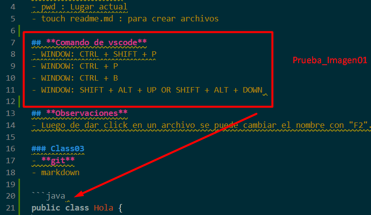

# Class02 : 30 de Abrl

## Comando de Linux
- pwd : Lugar actual
- touch readme.md : para crear archivos

## **Comando de vscode**
- WINDOW: CTRL + SHIFT + P
- WINDOW: CTRL + P
- WINDOW: CTRL + B
- WINDOW: SHIFT + ALT + UP OR touch SHIFT + ALT + DOWN 

## **Observaciones**
- Luego de dar click en un archivo se puede cambiar el nombre con "F2".

# Class03: 1 de May
- **git**
- markdown

```java 
public class Hola {
    public static void main (String[] args) {
        System.out.println():
    }     
}
```

|Columna 1|Columna 2|
|---------|---------|
|    A    |    B    |
|    C    |    D    |

Link
[buscador google](https://google.com)



# Class04: 6 de May
## Origen de Java:
 - Scott y Patrick se reunieron y crearon una nueva forma de resolver un proyecto al escribir algo diferente y ahi fue que surgió el compilador de Java.
 - El compilador y el interprete generan el código de máquina que esta diseñado para correr en el sistema operativo.
 - Ellos dejaron un código intermedio, es decir se utiliza el mismo compilador pero deja un **bytecode** (en java es un punto class). Sobre los sistemas operativos se instala el famoso SDK (hay para cada versión) y Las compilaciones generan un .class que se empaquetan. Luego con toma el código de máquina para distribuirlo a cada sistema operativo.
 - Ese mismo principio se utilizó para los dispositivos móviles.

# Class05: 7 de May 
si
